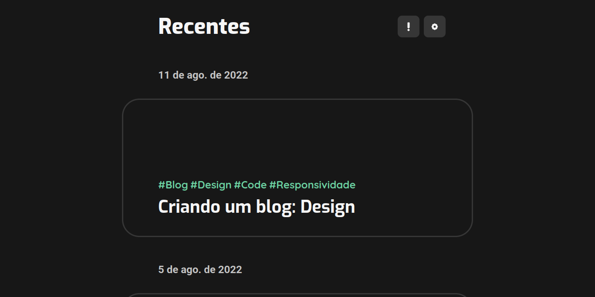

## AtlasComputing

Por:
[@Angelus Trindade](https://www.linkedin.com/in/angelus-t-a7659b141/)

Colaboradores: 
[@Jorge Santos](https://www.linkedin.com/in/jorge-santos-365b4823b)

 

O site AtlasComputing consiste em um blog produzido em react.js com assuntos voltados para programação, design e desenvolvimento.

## Instalando

Para executar o projeto, baixe o zip e extraia. 
Na pasta/directório, com o terminal execute: 

### `npm install` e `npm start` 

O programa iniciará no seu navegador automaticamente na URL:  
http://localhost:3000 

## Projeto 

O blog consiste em 3 principais telas: 

A tela principal onde aparecem os artigos, a tela do artigo expandido e a tela de sobre.

### 🤖 Tecnologias usadas:  

HTML, CSS, SCSS, Javascript, React, React-Router, Markdown-to-js, CSSTransition

### 💻 Código:

No arquivo 'App.js' se encontra a função de entrada 'App()'; a função responsável pelo menu lateral nas telas pequenas: Menu(); finalmente, as funções responsáveis pelas telas.

Existe ainda os arquivos referentes a barra de navegação e aos botões, respectivamente: 'Navbar.js' e 'Button.js'. 'PostCard.js' se refere ao componente do artigo na tela principal enquanto 'Icon.js' se refere a todos os icones do site.

No 'App.scss' e 'App.css' se encontram os estilos da página.

### 🔧 Site hospedado:
[https://atlas-computing.vercel.app/](https://atlas-computing.vercel.app/)

### 💡Pranchetas de design (figma): 

[https://www.figma.com/file/yFtcJ4CO9jskjEQBw8Lgaf/Blog?node-id=0%3A1](https://www.figma.com/file/yFtcJ4CO9jskjEQBw8Lgaf/Blog?node-id=0%3A1) 